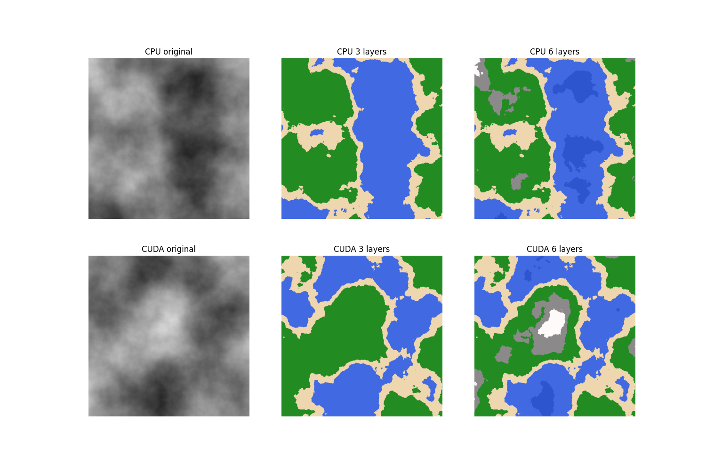
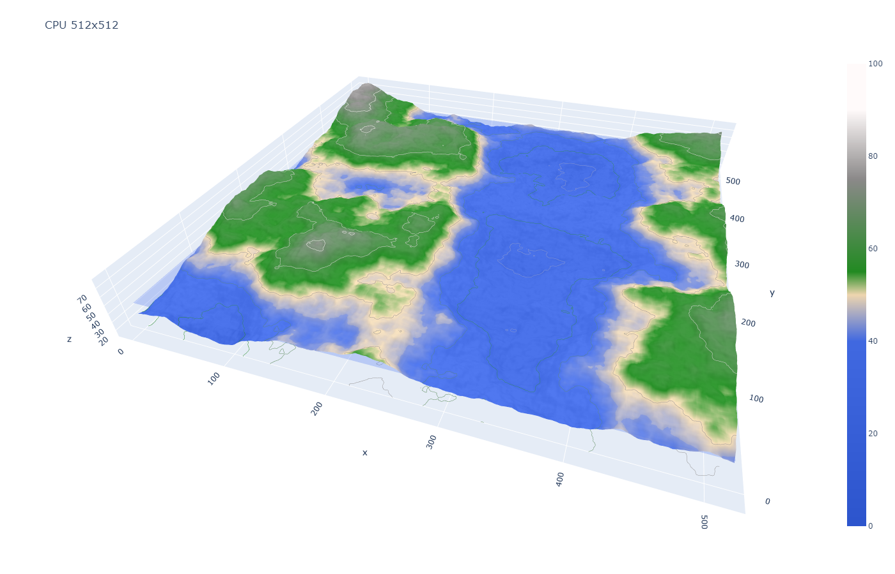
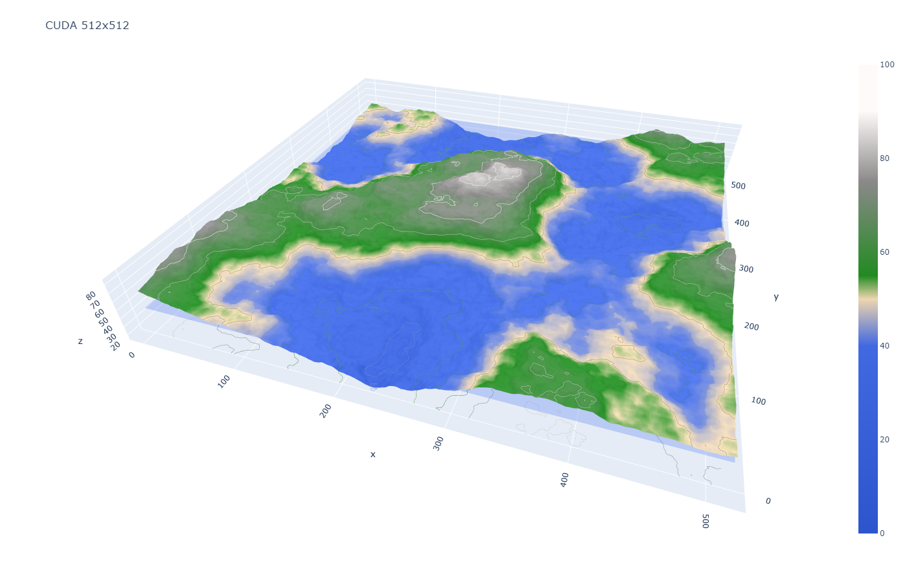
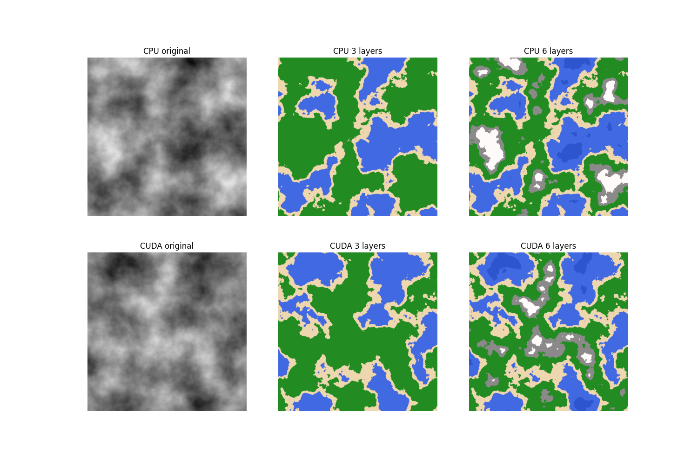
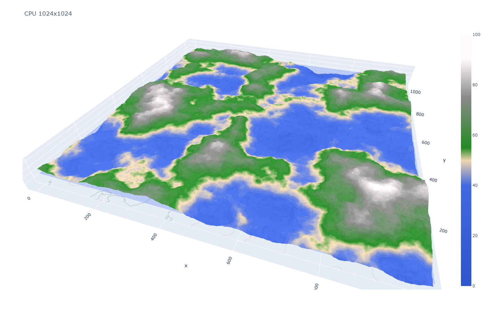
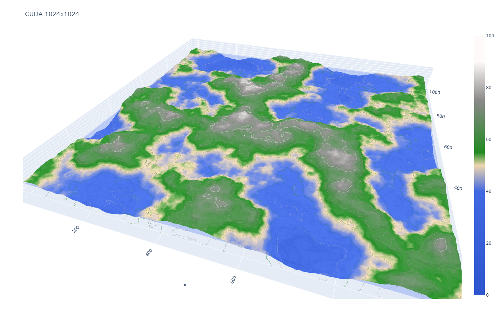
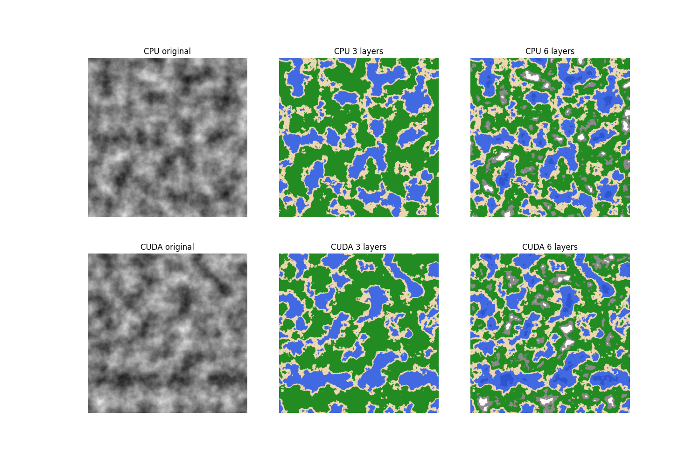
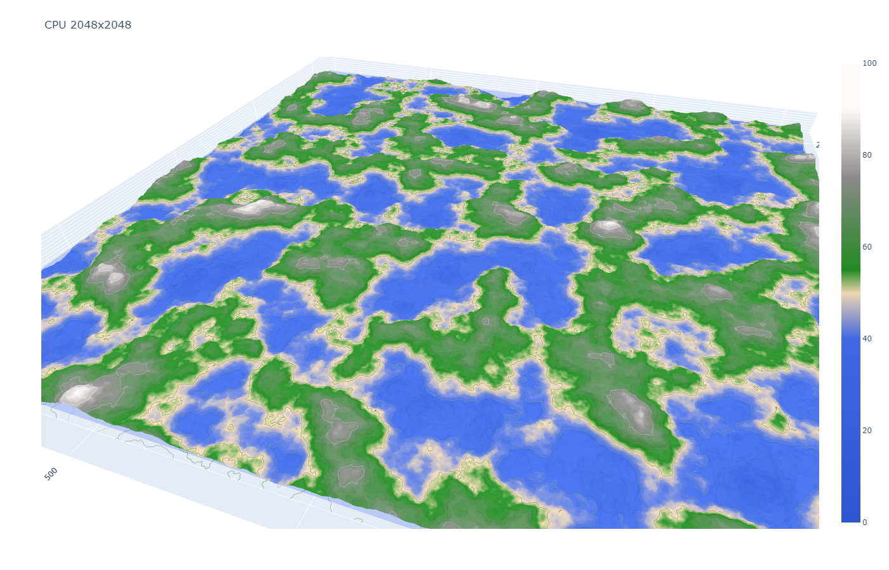
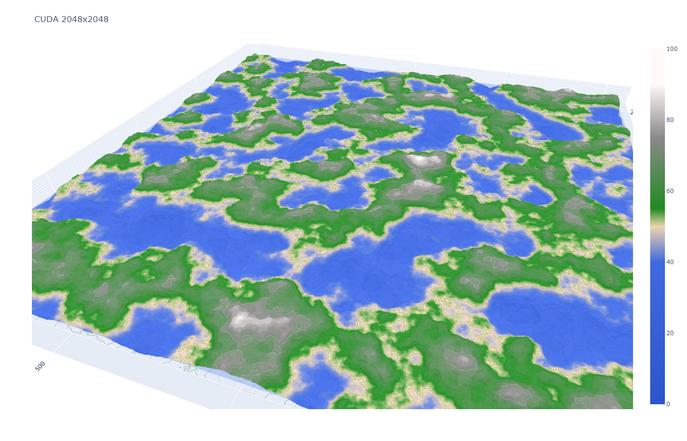

# CUDA-accelerated-Perlin-Noise-POC
[](https://doi.org/10.5281/zenodo.4430681)

Console utility for benchmarking CPU vs CUDA perlin noise performance and for generating 2D and 3D perlin noise terrain visualizations.

## Installation
Code was written for Python 3.8.  
Install [PyTorch](https://pytorch.org/get-started/locally/).  
Install additional packages:
> pip install -r requirements.txt

## Usage
```
usage: cuda_accelerated_perlin_noise.py [-h] [-b BENCH] [--p2d] [--p3d] [-z ZOOM]

Generate image or benchmark

optional arguments:
  -h, --help            show this help message and exit
  -b BENCH, --bench BENCH, --benchmark BENCH
                        number of iterations (default 0)
  --p2d, --plot2d       generate 2d plots
  --p3d, --plot3d       generate 3d plots
  -z ZOOM, --zoom ZOOM  zoom level (default 1)
```

## Examples
### Zoom 1
```commandline 
cuda_accelerated_perlin_noise.py --p2d --p3d -z 1
```



### Zoom 2
```commandline 
cuda_accelerated_perlin_noise.py --p2d --p3d -z 2
``` 



### Zoom 4
```commandline 
cuda_accelerated_perlin_noise.py --p2d --p3d -z 4
``` 



